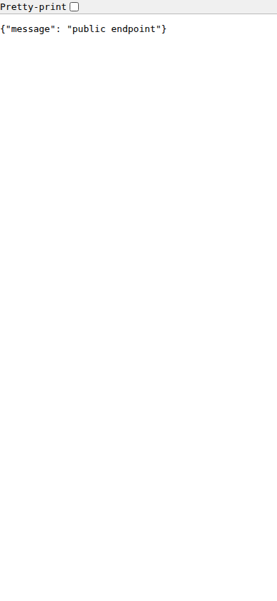

# flask-template — Quick Tutorial (10 minutes)

## Prerequisites

- Python 3.10+ and `make`
- Set `JWT_SECRET` in `.env` before running

## What you'll build

Run the Flask API locally and capture mobile screenshots of the
Swagger UI and representative API responses.

## Steps

1. Install

```bash
cd Templates/flask-template
make install
```

2. Run (default port: `8000`)

```bash
make run
```

3. Capture mobile screenshots

```bash
bash Scripts/ubuntu/screenshots-generic.sh \
  --config Templates/flask-template/docs/screenshot-config.json
```

4. See images in:

`Templates/flask-template/docs/screenshots/v1`

Placeholder previews:



